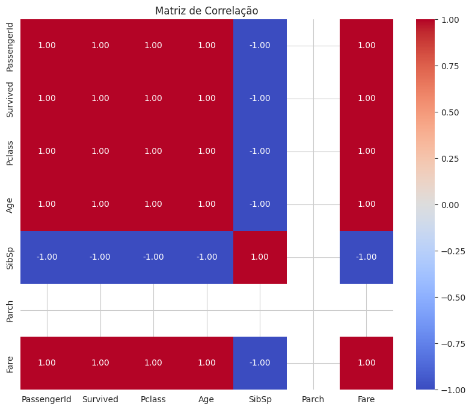

```python
# Grupo 1 - notebook_titanicsurvivalprediction

import numpy as np # Manipulação de matrizes
import pandas as pd # Criação e manipulação de dataset
%matplotlib inline
from pandas import *
import matplotlib.pyplot as plt # Plotagem de dados
import seaborn as sns # Plotagem e visualização dos dados
from tabulate import tabulate
from scipy.stats import chi2_contingency


import os
for dirname, _, filenames in os.walk('/kaggle/input'):
    for filename in filenames:
        print(os.path.join(dirname, filename))
        
```

    /kaggle/input/db-grupo1/Titanic-Dataset.csv
    


```python
# Criando dataset
df = pd.read_csv("/kaggle/input/db-grupo1/Titanic-Dataset.csv")

# Visualização inicial do dataset
df.head()
```


```python
# Número de linhas do Data Frame
df.shape
```


    (891, 12)


```python
# Colunas presentes no Data Frame
df.columns
```


    Index(['PassengerId', 'Survived', 'Pclass', 'Name', 'Sex', 'Age', 'SibSp',
           'Parch', 'Ticket', 'Fare', 'Cabin', 'Embarked'],
          dtype='object')


```python
# Avaliando a existência de dados nulos
df.isnull().sum()
```


    PassengerId      0
    Survived         0
    Pclass           0
    Name             0
    Sex              0
    Age            177
    SibSp            0
    Parch            0
    Ticket           0
    Fare             0
    Cabin          687
    Embarked         2
    dtype: int64


```python
# Avaliando valores nulos
df[df.isnull().any(axis=1)]
```


<div>
<style scoped>
    .dataframe tbody tr th:only-of-type {
        vertical-align: middle;
    }

    .dataframe tbody tr th {
        vertical-align: top;
    }

    .dataframe thead th {
        text-align: right;
    }
</style>
<table border="1" class="dataframe">
  <thead>
    <tr style="text-align: right;">
      <th></th>
      <th>PassengerId</th>
      <th>Survived</th>
      <th>Pclass</th>
      <th>Name</th>
      <th>Sex</th>
      <th>Age</th>
      <th>SibSp</th>
      <th>Parch</th>
      <th>Ticket</th>
      <th>Fare</th>
      <th>Cabin</th>
      <th>Embarked</th>
    </tr>
  </thead>
  <tbody>
    <tr>
      <th>0</th>
      <td>1</td>
      <td>0</td>
      <td>3</td>
      <td>Braund, Mr. Owen Harris</td>
      <td>male</td>
      <td>22.0</td>
      <td>1</td>
      <td>0</td>
      <td>A/5 21171</td>
      <td>7.2500</td>
      <td>NaN</td>
      <td>S</td>
    </tr>
    <tr>
      <th>2</th>
      <td>3</td>
      <td>1</td>
      <td>3</td>
      <td>Heikkinen, Miss. Laina</td>
      <td>female</td>
      <td>26.0</td>
      <td>0</td>
      <td>0</td>
      <td>STON/O2. 3101282</td>
      <td>7.9250</td>
      <td>NaN</td>
      <td>S</td>
    </tr>
    <tr>
      <th>4</th>
      <td>5</td>
      <td>0</td>
      <td>3</td>
      <td>Allen, Mr. William Henry</td>
      <td>male</td>
      <td>35.0</td>
      <td>0</td>
      <td>0</td>
      <td>373450</td>
      <td>8.0500</td>
      <td>NaN</td>
      <td>S</td>
    </tr>
    <tr>
      <th>5</th>
      <td>6</td>
      <td>0</td>
      <td>3</td>
      <td>Moran, Mr. James</td>
      <td>male</td>
      <td>NaN</td>
      <td>0</td>
      <td>0</td>
      <td>330877</td>
      <td>8.4583</td>
      <td>NaN</td>
      <td>Q</td>
    </tr>
    <tr>
      <th>7</th>
      <td>8</td>
      <td>0</td>
      <td>3</td>
      <td>Palsson, Master. Gosta Leonard</td>
      <td>male</td>
      <td>2.0</td>
      <td>3</td>
      <td>1</td>
      <td>349909</td>
      <td>21.0750</td>
      <td>NaN</td>
      <td>S</td>
    </tr>
    <tr>
      <th>...</th>
      <td>...</td>
      <td>...</td>
      <td>...</td>
      <td>...</td>
      <td>...</td>
      <td>...</td>
      <td>...</td>
      <td>...</td>
      <td>...</td>
      <td>...</td>
      <td>...</td>
      <td>...</td>
    </tr>
    <tr>
      <th>884</th>
      <td>885</td>
      <td>0</td>
      <td>3</td>
      <td>Sutehall, Mr. Henry Jr</td>
      <td>male</td>
      <td>25.0</td>
      <td>0</td>
      <td>0</td>
      <td>SOTON/OQ 392076</td>
      <td>7.0500</td>
      <td>NaN</td>
      <td>S</td>
    </tr>
    <tr>
      <th>885</th>
      <td>886</td>
      <td>0</td>
      <td>3</td>
      <td>Rice, Mrs. William (Margaret Norton)</td>
      <td>female</td>
      <td>39.0</td>
      <td>0</td>
      <td>5</td>
      <td>382652</td>
      <td>29.1250</td>
      <td>NaN</td>
      <td>Q</td>
    </tr>
    <tr>
      <th>886</th>
      <td>887</td>
      <td>0</td>
      <td>2</td>
      <td>Montvila, Rev. Juozas</td>
      <td>male</td>
      <td>27.0</td>
      <td>0</td>
      <td>0</td>
      <td>211536</td>
      <td>13.0000</td>
      <td>NaN</td>
      <td>S</td>
    </tr>
    <tr>
      <th>888</th>
      <td>889</td>
      <td>0</td>
      <td>3</td>
      <td>Johnston, Miss. Catherine Helen "Carrie"</td>
      <td>female</td>
      <td>NaN</td>
      <td>1</td>
      <td>2</td>
      <td>W./C. 6607</td>
      <td>23.4500</td>
      <td>NaN</td>
      <td>S</td>
    </tr>
    <tr>
      <th>890</th>
      <td>891</td>
      <td>0</td>
      <td>3</td>
      <td>Dooley, Mr. Patrick</td>
      <td>male</td>
      <td>32.0</td>
      <td>0</td>
      <td>0</td>
      <td>370376</td>
      <td>7.7500</td>
      <td>NaN</td>
      <td>Q</td>
    </tr>
  </tbody>
</table>
<p>708 rows × 12 columns</p>
</div>


```python
# Informações sobre o conjunto de dados
print("\nInformações sobre o conjunto de dados:")
print(df.info())
```

    
    Informações sobre o conjunto de dados:
    <class 'pandas.core.frame.DataFrame'>
    RangeIndex: 891 entries, 0 to 890
    Data columns (total 12 columns):
     #   Column       Non-Null Count  Dtype  
    ---  ------       --------------  -----  
     0   PassengerId  891 non-null    int64  
     1   Survived     891 non-null    int64  
     2   Pclass       891 non-null    int64  
     3   Name         891 non-null    object 
     4   Sex          891 non-null    object 
     5   Age          714 non-null    float64
     6   SibSp        891 non-null    int64  
     7   Parch        891 non-null    int64  
     8   Ticket       891 non-null    object 
     9   Fare         891 non-null    float64
     10  Cabin        204 non-null    object 
     11  Embarked     889 non-null    object 
    dtypes: float64(2), int64(5), object(5)
    memory usage: 83.7+ KB
    None
    


```python
# Remover avisos
import warnings
warnings.simplefilter(action='ignore', category=FutureWarning)

# Análise exploratória dos dados
sns.set_style("whitegrid")

# Gráfico: Distribuição da sobrevivência por sexo
plt.figure(figsize=(8, 6))
sns.countplot(data=df, x='Survived', hue='Sex')
plt.title('Distribuição da Sobrevivência por Sexo')
plt.xlabel('Sobreviveu?')
plt.ylabel('Contagem')
plt.show()

# Gráfico: Distribuição da sobrevivência por classe
plt.figure(figsize=(8, 6))
sns.countplot(data=df, x='Survived', hue='Pclass')
plt.title('Distribuição da Sobrevivência por Classe')
plt.xlabel('Sobreviveu?')
plt.ylabel('Contagem')
plt.show()

# Gráfico: Distribuição da sobrevivência por idade
plt.figure(figsize=(8, 6))
sns.histplot(data=df, x='Age', hue='Survived', kde=True)
plt.title('Distribuição da Sobrevivência por Idade')
plt.xlabel('Idade')
plt.ylabel('Contagem')
plt.show()
```


    

    


    
!](/docs/img/output_7_1.png)
    


    

    


```python
# Calcula as estatísticas descritivas
statistics = df.describe(include='all')

# Imprimir as estatísticas descritivas em uma tabela formatada
print("Estatísticas Descritivas:")
print(tabulate(statistics, headers='keys', tablefmt='fancy_grid'))

# Ajustando largura das colunas
colalign = ['center'] * len(statistics.columns)

# Converte os dados do DataFrame em uma tabela formatada
table = tabulate(statistics, headers='keys', tablefmt='pretty', showindex=True, colalign=colalign)
```

    Estatísticas Descritivas:
    ╒════════╤═══════════════╤════════════╤════════════╤═════════════════════════╤═══════╤══════════╤════════════╤════════════╤══════════╤══════════╤═════════╤════════════╕
    │        │   PassengerId │   Survived │     Pclass │ Name                    │ Sex   │      Age │      SibSp │      Parch │   Ticket │     Fare │ Cabin   │ Embarked   │
    ╞════════╪═══════════════╪════════════╪════════════╪═════════════════════════╪═══════╪══════════╪════════════╪════════════╪══════════╪══════════╪═════════╪════════════╡
    │ count  │       891     │ 891        │ 891        │ 891                     │ 891   │ 714      │ 891        │ 891        │      891 │ 891      │ 204     │ 889        │
    ├────────┼───────────────┼────────────┼────────────┼─────────────────────────┼───────┼──────────┼────────────┼────────────┼──────────┼──────────┼─────────┼────────────┤
    │ unique │       nan     │ nan        │ nan        │ 891                     │ 2     │ nan      │ nan        │ nan        │      681 │ nan      │ 147     │ 3          │
    ├────────┼───────────────┼────────────┼────────────┼─────────────────────────┼───────┼──────────┼────────────┼────────────┼──────────┼──────────┼─────────┼────────────┤
    │ top    │       nan     │ nan        │ nan        │ Braund, Mr. Owen Harris │ male  │ nan      │ nan        │ nan        │   347082 │ nan      │ B96 B98 │ S          │
    ├────────┼───────────────┼────────────┼────────────┼─────────────────────────┼───────┼──────────┼────────────┼────────────┼──────────┼──────────┼─────────┼────────────┤
    │ freq   │       nan     │ nan        │ nan        │ 1                       │ 577   │ nan      │ nan        │ nan        │        7 │ nan      │ 4       │ 644        │
    ├────────┼───────────────┼────────────┼────────────┼─────────────────────────┼───────┼──────────┼────────────┼────────────┼──────────┼──────────┼─────────┼────────────┤
    │ mean   │       446     │   0.383838 │   2.30864  │ nan                     │ nan   │  29.6991 │   0.523008 │   0.381594 │      nan │  32.2042 │ nan     │ nan        │
    ├────────┼───────────────┼────────────┼────────────┼─────────────────────────┼───────┼──────────┼────────────┼────────────┼──────────┼──────────┼─────────┼────────────┤
    │ std    │       257.354 │   0.486592 │   0.836071 │ nan                     │ nan   │  14.5265 │   1.10274  │   0.806057 │      nan │  49.6934 │ nan     │ nan        │
    ├────────┼───────────────┼────────────┼────────────┼─────────────────────────┼───────┼──────────┼────────────┼────────────┼──────────┼──────────┼─────────┼────────────┤
    │ min    │         1     │   0        │   1        │ nan                     │ nan   │   0.42   │   0        │   0        │      nan │   0      │ nan     │ nan        │
    ├────────┼───────────────┼────────────┼────────────┼─────────────────────────┼───────┼──────────┼────────────┼────────────┼──────────┼──────────┼─────────┼────────────┤
    │ 25%    │       223.5   │   0        │   2        │ nan                     │ nan   │  20.125  │   0        │   0        │      nan │   7.9104 │ nan     │ nan        │
    ├────────┼───────────────┼────────────┼────────────┼─────────────────────────┼───────┼──────────┼────────────┼────────────┼──────────┼──────────┼─────────┼────────────┤
    │ 50%    │       446     │   0        │   3        │ nan                     │ nan   │  28      │   0        │   0        │      nan │  14.4542 │ nan     │ nan        │
    ├────────┼───────────────┼────────────┼────────────┼─────────────────────────┼───────┼──────────┼────────────┼────────────┼──────────┼──────────┼─────────┼────────────┤
    │ 75%    │       668.5   │   1        │   3        │ nan                     │ nan   │  38      │   1        │   0        │      nan │  31      │ nan     │ nan        │
    ├────────┼───────────────┼────────────┼────────────┼─────────────────────────┼───────┼──────────┼────────────┼────────────┼──────────┼──────────┼─────────┼────────────┤
    │ max    │       891     │   1        │   3        │ nan                     │ nan   │  80      │   8        │   6        │      nan │ 512.329  │ nan     │ nan        │
    ╘════════╧═══════════════╧════════════╧════════════╧═════════════════════════╧═══════╧══════════╧════════════╧════════════╧══════════╧══════════╧═════════╧════════════╛
    


```python
# Exibir as estatísticas inferenciais
print("Estatísticas Inferenciais:\n")
```

    Estatísticas Inferenciais:
    
    


```python
# Calcular as taxas de sobrevivência
survival_rate_sex = df.groupby('Sex')['Survived'].mean()
survival_rate_class = df.groupby('Pclass')['Survived'].mean()
survival_rate_age = df.groupby(pd.cut(df['Age'], bins=[0, 18, 30, 50, 100]))['Survived'].mean()

# Memória de Cálculo
print("Memória de Cálculo:")
print("Taxa de Sobrevivência por Sexo:")
print(tabulate(survival_rate_sex.reset_index(), headers='keys', tablefmt='fancy_grid'))
print("\nTaxa de Sobrevivência por Classe Socioeconômica:")
print(tabulate(survival_rate_class.reset_index(), headers='keys', tablefmt='fancy_grid'))
print("\nTaxa de Sobrevivência por Faixa Etária:")
print(tabulate(survival_rate_age.reset_index(), headers='keys', tablefmt='fancy_grid'))

# Fórmulas
print("\nFórmulas Utilizadas:")
print("Taxa de Sobrevivência por Sexo: (Número de Sobreviventes do Sexo / Número Total de Passageiros do Sexo)")
print("Taxa de Sobrevivência por Classe Socioeconômica: (Número de Sobreviventes da Classe / Número Total de Passageiros da Classe)")
print("Taxa de Sobrevivência por Faixa Etária: (Número de Sobreviventes na Faixa Etária / Número Total de Passageiros na Faixa Etária)")
```

    Memória de Cálculo:
    Taxa de Sobrevivência por Sexo:
    ╒════╤════════╤════════════╕
    │    │ Sex    │   Survived │
    ╞════╪════════╪════════════╡
    │  0 │ female │   0.742038 │
    ├────┼────────┼────────────┤
    │  1 │ male   │   0.188908 │
    ╘════╧════════╧════════════╛
    
    Taxa de Sobrevivência por Classe Socioeconômica:
    ╒════╤══════════╤════════════╕
    │    │   Pclass │   Survived │
    ╞════╪══════════╪════════════╡
    │  0 │        1 │   0.62963  │
    ├────┼──────────┼────────────┤
    │  1 │        2 │   0.472826 │
    ├────┼──────────┼────────────┤
    │  2 │        3 │   0.242363 │
    ╘════╧══════════╧════════════╛
    
    Taxa de Sobrevivência por Faixa Etária:
    ╒════╤═══════════╤════════════╕
    │    │ Age       │   Survived │
    ╞════╪═══════════╪════════════╡
    │  0 │ (0, 18]   │   0.503597 │
    ├────┼───────────┼────────────┤
    │  1 │ (18, 30]  │   0.355556 │
    ├────┼───────────┼────────────┤
    │  2 │ (30, 50]  │   0.423237 │
    ├────┼───────────┼────────────┤
    │  3 │ (50, 100] │   0.34375  │
    ╘════╧═══════════╧════════════╛
    
    Fórmulas Utilizadas:
    Taxa de Sobrevivência por Sexo: (Número de Sobreviventes do Sexo / Número Total de Passageiros do Sexo)
    Taxa de Sobrevivência por Classe Socioeconômica: (Número de Sobreviventes da Classe / Número Total de Passageiros da Classe)
    Taxa de Sobrevivência por Faixa Etária: (Número de Sobreviventes na Faixa Etária / Número Total de Passageiros na Faixa Etária)
    


```python
# Testes Estatísticos Inferenciais outro método
print("Testes Estatísticos Inferenciais outro método:\n")
# Teste qui-quadrado para verificar a independência entre sexo e sobrevivência
contingency_table = pd.crosstab(df['Sex'], df['Survived'])
chi2, p, dof, expected = chi2_contingency(contingency_table)
```

    Testes Estatísticos Inferenciais outro método:
    
    


```python
# Imprimir resultado do teste qui-quadrado
result_table = [
    ["Teste Qui-Quadrado entre Sexo e Sobrevivência:", "", ""],
    ["Valor de Qui-Quadrado:", chi2, ""],
    ["p-valor:", p, ""]
]

# Imprime a tabela
print(tabulate(result_table, tablefmt='pretty'))
```

    +------------------------------------------------+------------------------+--+
    | Teste Qui-Quadrado entre Sexo e Sobrevivência: |                        |  |
    |             Valor de Qui-Quadrado:             |   260.71702016732104   |  |
    |                    p-valor:                    | 1.1973570627755645e-58 |  |
    +------------------------------------------------+------------------------+--+
    


```python
# Calcula a matriz de correlação
correlation_matrix = numeric_columns.corr()

# Cria um heatmap da matriz de correlação
plt.figure(figsize=(10, 8))
sns.heatmap(correlation_matrix, annot=True, cmap='coolwarm', fmt=".2f")
plt.title('Matriz de Correlação')
plt.show()
```


    

    

